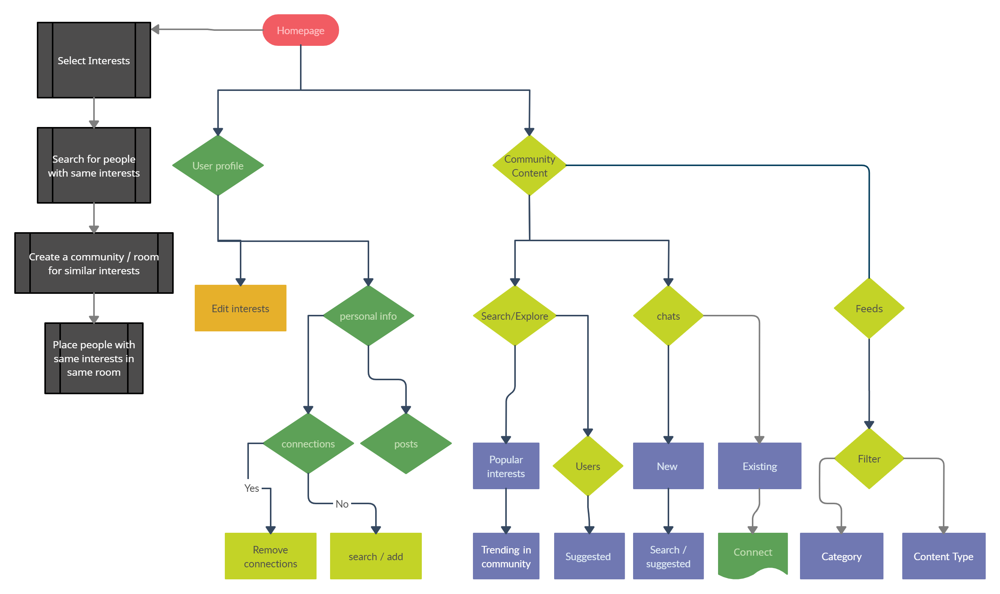

# Team Vikings

# CONNECT <3

# About
Connect is an Web Application that helps like minded people connect .Take the input from the users and put the people who have similar interest in the same cluster where they can talk and make healthy discussions.
-> You can connect with people having same idealogy based on your location too.

# Features
Communtiy content:

    1. Search/Explore: 
So the users can search other users in the community based on user id's and make new connections with them. And if the user wants to find new people in the community there will be a suggested list based on the user's selected interests.
The user will also be given a feature to explore the trending contents in the community by choosing the desired interest tabs.

    2. Chats:
Once a match is found the user can initiate the conversation by sending a text.
The other user can then block and initiate a conversation based on the message.
The messages send will be stored and wont be lost when the user closes the application.
    
    3. Feeds:
Filter the cotent -> The users are given a feature to filter the contents based on their wish based on category and content type.
Category filter includes by post , questions or poll. The user can pick one or more of these category filters to narrow down the search.
Content Type includes by Text, Image or by link the content consists. The user can pick one or more of these content type filters to narrow down the search.

    4. Content:
The user can post content in the community either in the form of a question, poll or a regular post.
Other users can react to a post by upvoting, commenting and also sharing the post.
There are certain content policies that the user has to follow. Breaking the set of rules of Unacceptable content can lead to enforcement of Temporary or permanent suspension of accounts, Removal of content or getting banned from the communities.

# Technologies tools used:

Frontend: JavaScript,HTML,CSS,

Backend: JavaScript(Node JS)

Database-Management: Firebase

# Check out our [blog](https://vikingamrita.blogspot.com/?m=1) for more information:

